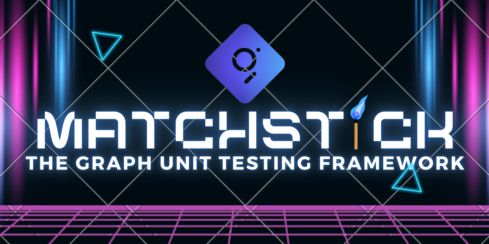

# Building Bulletproof Subgraphs

[](https://ceocodes.medium.com/building-bulletproof-subgraphs-unit-testing-with-matchstick-f39610c778b3)

## Description

This repository is for an [article](https://ceocodes.medium.com/building-bulletproof-subgraphs-unit-testing-with-matchstick-f39610c778b3) guiding users on developing robust and bug-free subgraphs leveraging the [Matchstick Unit Testing framework](https://github.com/LimeChain/matchstick).

Follow the [medium article](https://ceocodes.medium.com/building-bulletproof-subgraphs-unit-testing-with-matchstick-f39610c778b3) to get the most out of this tutorial

### Table of Content

- [Description](#description)
- [Setting Up](#setting-up)
  - [Cloning repo](#cloning)
  - [Installation](#installation)
- [Live subgraphs](#live-subgraphs)

## Setting Up

### Cloning repo

Clone this repository by running the below command on your terminal:

```bash
git clone https://github.com/E-Zbox/building-bulletproof-subgraphs
```

### Installation

Run the `yarn` command on your terminal to install project dependencies

## Live subgraphs

Each version prior to the latest has a bug (wrong implementation) that went unnoticed before deployment hence, the importance of unit testing before deploying your subgraphs.

> **Deployed Subgraph :** [(v0.0.1)](https://api.studio.thegraph.com/query/50548/uniswap-sushi-eth-lp/v0.0.1)

> **Deployed Subgraph :** [(v0.0.2)](https://api.studio.thegraph.com/query/50548/uniswap-sushi-eth-lp/v0.0.2)

> **Deployed Subgraph :** [(v0.0.3)](https://api.studio.thegraph.com/query/50548/uniswap-sushi-eth-lp/v0.0.3) 
